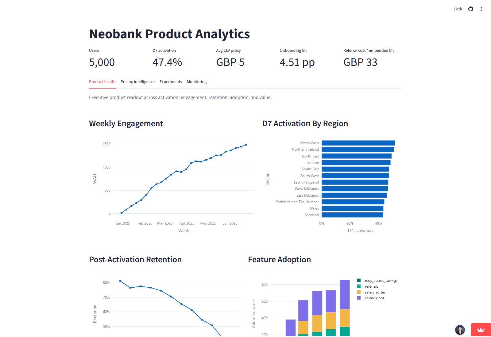

# Customer Growth & Pricing Intelligence Platform

[](https://github.com/rosscyking1115/neobank-product-analytics/actions/workflows/ci.yml)
[](https://github.com/rosscyking1115/neobank-product-analytics/actions/workflows/monitoring-snapshot.yml)

[Live Streamlit dashboard](https://neobank-appuct-analytics.streamlit.app/)



A synthetic neobank product analytics case study using dbt, DuckDB, Python,
experimentation, activation modelling, and geo-lift analysis.

This repo simulates the end-to-end workflow of a Product Data Scientist working
in a modern fintech squad: generate realistic event data, build trusted metrics,
analyse product experiments, package model and pricing decisioning, monitor the
outputs, and translate the work into a PM-ready dashboard.

The project is intentionally synthetic: no customer data, private fintech data,
or proprietary business metrics are used.

## Live Demo

[Open the Streamlit dashboard](https://neobank-appuct-analytics.streamlit.app/)
to review the PM-facing product surfaces:

- Product health: activation, engagement, retention, feature adoption, and CLV
  proxy.
- Pricing intelligence: offer economics, guarded recommendations, scenario
  runs, and sensitivity analysis.
- Experiments: onboarding A/B and referral geo-incrementality readouts.
- Monitoring: release-gate checks for marts, pricing, API readiness, batch
  scores, drift, and calibration.

The first load may take a moment on Streamlit Community Cloud because the app can
bootstrap a lightweight synthetic DuckDB demo warehouse when no persisted
database is present.

## Five-Minute Review

1. Open the
   [Streamlit dashboard](https://neobank-appuct-analytics.streamlit.app/):
   product health, pricing intelligence, experiments, and monitoring.
2. Skim `docs/ARCHITECTURE.md` for the local and cloud-ready architecture.
3. Skim the API contract in `docs/API.md` for activation, churn, upsell, offer,
   and pricing scenario endpoints.
4. Review the dbt marts in `dbt_neobank/models/` for the trusted metrics layer.
5. Read the activation model card in `docs/model_cards/`.
6. Check the operational docs: `docs/MONITORING.md`,
   `docs/PRICING_SCENARIOS.md`, and `docs/OPERATIONS_RUNBOOK.md`.

## Portfolio Highlights

- Built a reproducible synthetic neobank warehouse covering users, transactions,
  sessions, feature events, referrals, support contacts, and experiments.
- Modelled activation, retention, engagement, feature adoption, CLV proxy,
  experiment metrics, and region-day referral incrementality in dbt.
- Analysed a personalised onboarding A/B test with SRM, CUPED, guardrails, power,
  heterogeneous effects, and a launch recommendation.
- Trained and documented an activation decisioning model with calibration,
  explainability, fairness-oriented segment checks, and customer-outcome guardrails.
- Added FastAPI prediction and scenario contracts for activation, churn, upsell,
  offer recommendation, and pricing simulation.
- Added batch activation scoring, model drift reporting, realised-label
  calibration monitoring, and an operational runbook.
- Built pricing intelligence outputs with offer economics, guarded
  recommendations, persisted scenario runs, and sensitivity analysis.
- Estimated regional referral incrementality using DiD, synthetic control,
  spillover checks, placebos, and embedded ground-truth recovery.
- Exercised the GCS-to-BigQuery raw landing path and ran the dbt graph on
  BigQuery with 107 passing dbt checks.
- Exercised the BigQuery activation-score load path with 5,000 daily customer
  scores in `neobank_ml.customer_scores_daily`.
- Exercised BigQuery score monitoring with a passing warehouse-side health check
  for volume, uniqueness, targeting, vulnerable-review, and probability bounds.
- Deployed Cloud Run Jobs for activation score loading and BigQuery score
  monitoring.
- Scheduled the Cloud Run Jobs with Cloud Scheduler at 06:00 and 06:30
  Europe/London, using a dedicated scheduler service account.
- Delivered a Streamlit dashboard designed for product and growth review.

## Why This Exists

This project simulates a neobank product analytics workflow on a stack that mirrors
how a modern fintech data team works: warehouse-backed metrics, dbt transformations,
Python modelling, experimentation, guarded model decisioning, and product
surfaces that a product manager could act on.

The project is aimed at a Product Data Scientist role with a Growth/Marketing accent.
It keeps activation, retention, primary-bank engagement, and customer lifetime value
central, while using a regional referral incrementality chapter to show causal
thinking around network effects.

## Fintech Product Analytics Themes

The case study is designed around public fintech product analytics themes:

- Product analytics in embedded squads: metrics, experimentation, targeting models,
  ambiguity, and communication.
- Data platform expectations: dbt, governed data products, ownership, model
  interfaces, freshness, and CI checks.
- Business priorities: primary banking, word-of-mouth growth, business banking,
  borrowing, wealth, safety, and responsible machine learning.
- Fintech standards: Consumer Duty guardrails, vulnerable-customer checks, model
  explainability, exposure logging, sample-ratio checks, and rollout monitoring.

## Deliverables

- Synthetic neobank event data for users, transactions, sessions, features,
  referrals, support contacts, and experiments.
- dbt metrics layer with activation, retention, engagement, feature adoption, CLV
  proxy, experiment user metrics, pricing outcomes, and geo daily signups.
- Marimo notebooks for EDA, A/B testing with CUPED, activation decisioning, and
  regional referral incrementality.
- Calibrated activation model with explainability and customer-outcome guardrails.
- Pricing intelligence marts with offer exposure, unit economics, and guardrail
  recommendation reason codes.
- Streamlit dashboard for product metrics, pricing intelligence, and experiment
  readouts.
- FastAPI service boundary for prediction and scenario contracts.
- Monitoring and operations docs for release gating, score drift, calibration,
  and rollout triage.
- One-page written recommendations for the A/B onboarding test and referral geo
  experiment in `docs/memos/`.
- Portfolio release notes with CV and LinkedIn wording in `docs/PORTFOLIO_RELEASE.md`.
- Public launch copy, repo description, screenshot checklist, and CV wording in
  `docs/PUBLIC_LAUNCH.md`.

## Core Metrics

- D7 activation: first card transaction within 7 days of signup.
- W4 retention: activated users transacting in week 4.
- Feature adoption: Savings Pots, Salary Sorter, referrals, and related product use.
- WAU and transaction frequency.
- CLV proxy: simulated 12-month net revenue per user.
- Guardrails: support contact rate, complaint/contact load, fraud flags, crash rate,
  vulnerable-customer impact, and fair-value/customer-understanding signals.

## Local Setup

```powershell
uv sync --group dev
uv run python -m data_generator.generate --users 5000 --months 6 --output-dir raw/ci
uv run pytest
uv run ruff check .
uv run marimo check notebooks --ignore-scripts
uv run dbt build --project-dir dbt_neobank --profiles-dir dbt_neobank
```

## dbt Documentation

```powershell
uv run dbt docs generate --project-dir dbt_neobank --profiles-dir dbt_neobank
uv run dbt docs serve --project-dir dbt_neobank --profiles-dir dbt_neobank
```

## Run the Prediction API

```powershell
uv run uvicorn api.main:app --reload --port 8000
```

The API exposes activation, churn, upsell, offer recommendation, and pricing
scenario contracts. See `docs/API.md` for request examples and guardrail fields.

For the API container and Cloud Run path, see `docs/CLOUD_RUN_DEPLOYMENT.md`.
To render private-by-default Cloud Run service commands for the API:

```powershell
uv run python -m src.cloud.cloud_run_api_deploy_plan `
  --project neobank-growth-platform-ross `
  --project-number 319492039091 `
  --region europe-west2 `
  --invoker-email rosscyking@gmail.com
```

The private Cloud Run API service was deployed and smoke-tested on 2026-05-31:
`neobank-api-00002-qc4` served `/health` with `status = ok` and
`data_version = synthetic-portfolio`.
The private API also has an enabled log-based Cloud Monitoring policy:
`Neobank API service failure alert`.

## Generate Synthetic Data

```powershell
uv run python -m data_generator.generate --users 50000 --months 12 --output-dir raw/portfolio_full
```

The generator writes parquet files for users, experiment assignments, activation
ground truth, transactions, sessions, feature events, support contacts, referrals,
regional daily signups, and embedded experiment ground truth. The `raw/` directory
is gitignored so the data is reproducible without committing generated artifacts.

## Reproduce the Onboarding A/B Memo

```powershell
uv run python -m data_generator.generate --users 50000 --months 12 --output-dir raw/portfolio_full
uv run dbt build --project-dir dbt_neobank --profiles-dir dbt_neobank --vars "{raw_path: raw/portfolio_full}"
uv run python -m src.experiments.run_onboarding_ab
```

## Reproduce the Activation Model Card

```powershell
uv run python -m data_generator.generate --users 50000 --months 12 --output-dir raw/portfolio_full
uv run dbt build --project-dir dbt_neobank --profiles-dir dbt_neobank --vars "{raw_path: raw/portfolio_full}"
uv run python -m src.modelling.run_activation_model
```

The model command writes the model card plus an ignored local artifact registry at
`artifacts/models/activation/registry.json`. Set
`NEOBANK_ACTIVATION_MODEL_REGISTRY` to that file when serving model-backed
activation scores from the API.

## Reproduce Batch Activation Scores

```powershell
uv run python -m src.modelling.run_activation_model
uv run python -m src.modelling.batch_score_activation --score-date 2025-06-30
```

The batch scorer writes an ignored daily parquet extract under
`artifacts/scoring/activation/`. See `docs/BATCH_SCORING.md` for the output
contract.

To load the same score extract into BigQuery, render the reviewed command plan:

```powershell
uv run python -m src.cloud.bigquery_score_load_plan --score-date 2025-06-30
```

The plan uploads the parquet extract to Cloud Storage, creates the ML dataset if
needed, loads `customer_scores_daily` partitioned by `score_date`, and renders a
row-count verification query.

The demo GCP score load was exercised on 2026-05-31: 5,000 scored users, 1,390
targeted users, and 191 vulnerable-customer-review cases were verified in
`neobank_ml.customer_scores_daily`.

To monitor the loaded score table in BigQuery:

```powershell
uv run python -m src.cloud.bigquery_score_monitoring_plan `
  --score-date 2025-06-30 `
  --project neobank-growth-platform-ross `
  --dataset neobank_ml `
  --location EU `
  --min-rows 5000
```

The demo GCP score monitoring query was exercised on 2026-05-31 and returned
`monitoring_status = pass`: 5,000 scored users, 5,000 unique users, 1 model
version, 1,390 targeted users, 27.80% targeting rate, 191 vulnerable-review
users, 3.82% vulnerable-review rate, and activation probabilities bounded from
0.0000 to 1.0000.

To schedule Cloud Run scoring and monitoring jobs, render the Cloud Scheduler
plan:

```powershell
uv run python -m src.cloud.cloud_run_scheduler_plan `
  --project neobank-growth-platform-ross `
  --project-number 319492039091 `
  --run-region europe-west2 `
  --scheduler-region europe-west2 `
  --service-account-email neobank-scheduler@neobank-growth-platform-ross.iam.gserviceaccount.com
```

To deploy the underlying Cloud Run Jobs first, render the job deployment plan:

```powershell
uv run python -m src.cloud.cloud_run_job_deploy_plan `
  --project neobank-growth-platform-ross `
  --project-number 319492039091 `
  --region europe-west2 `
  --bucket neobank-growth-platform-ross-raw `
  --bq-location EU `
  --bq-ml-dataset neobank_ml `
  --bq-monitoring-dataset neobank_monitoring `
  --score-date 2025-06-30 `
  --users 5000 `
  --months 6
```

Omit `--score-date` for a rolling daily schedule; keep it for the reproducible
portfolio demo run.

Cloud Run and Cloud Scheduler were exercised on 2026-05-31 in
`europe-west2`:

- `neobank-activation-score-load` completed manually as
  `neobank-activation-score-load-khjjs`.
- `neobank-score-monitoring` completed manually as
  `neobank-score-monitoring-tl447`.
- Cloud Scheduler triggered `neobank-activation-score-load-6459k`
  successfully from `neobank-scheduler@neobank-growth-platform-ross.iam.gserviceaccount.com`.
- Cloud Scheduler triggered `neobank-score-monitoring-2pjlb`
  successfully from the same scheduler service account.
- The schedules were resumed and verified as `ENABLED` on 2026-05-31.
- A log-based Cloud Monitoring policy, `Neobank Cloud Run job failure alert`,
  was created and verified as enabled.
- A second log-based Cloud Monitoring policy,
  `Neobank API service failure alert`, was created and verified as enabled for
  private API service errors.
- A project budget alert was configured as the cost-control guardrail for the
  demo GCP project.

## Generate a Monitoring Snapshot

```powershell
uv run python -m src.monitoring.snapshot --snapshot-date 2025-06-30
uv run python -m src.monitoring.model_report --report-date 2025-06-30
uv run python -m src.monitoring.calibration_report --db neobank.duckdb --report-date 2025-07-07
```

The monitoring commands write JSON and Markdown reports under
`artifacts/monitoring/` with data quality, activation, experiment, pricing,
batch-scoring, API-readiness, score-distribution, drift, and realised-label
calibration checks. See `docs/MONITORING.md` and `docs/OPERATIONS_RUNBOOK.md`.

## Render the GCP Warehouse Load Plan

```powershell
uv run python -m src.cloud.gcp_load_plan
```

The load plan turns the tracked Cloud Storage/BigQuery manifest into `bq load`
commands for the raw parquet warehouse landing layer. See `docs/GCP_WAREHOUSE.md`.

## Export Cloud-Ready Raw Data

```powershell
uv run python -m src.cloud.export --profile demo
```

The cloud export command writes generated parquet files plus `manifest.json`
under `NEOBANK_CLOUD_EXPORT_DIR`, which defaults to `data/cloud_export/demo`.
The manifest records row counts, schema version, generation config, column
types, and file sizes so the raw landing package can be checked before upload.

Copy `.env.example` to `.env` for local overrides. Keep `NEOBANK_ENV=local` for
the public demo path; switch to `NEOBANK_ENV=gcp` only when `GCP_PROJECT_ID` and
`NEOBANK_GCS_RAW_BUCKET` are configured outside git.

Render the matching Cloud Storage upload plan after export:

```powershell
uv run python -m src.cloud.gcs_upload_plan --manifest data/cloud_export/demo/manifest.json
```

After the GCS upload and BigQuery raw loads, render a row-count verification
plan:

```powershell
uv run python -m src.cloud.bigquery_verify_plan --project neobank-growth-platform-ross --dataset neobank_raw --expected-export-manifest data/cloud_export/demo/manifest.json
```

Render the matching cleanup and cost-control plan before leaving live GCP
resources running:

```powershell
uv run python -m src.cloud.gcp_cleanup_plan --project neobank-growth-platform-ross --dataset neobank_raw --bucket neobank-growth-platform-ross-raw --prefix neobank/raw/demo
```

To run the dbt graph against BigQuery after loading raw tables:

```powershell
uv sync --extra gcp --group dev
$env:NEOBANK_BQ_DEFAULT_DATASET="neobank_dev"
$env:NEOBANK_BQ_DATASET_PREFIX="neobank"
uv run dbt build --project-dir dbt_neobank --profiles-dir dbt_neobank --profile neobank --target bigquery
```

## Reproduce Pricing Intelligence Marts

```powershell
uv run python -m data_generator.generate --users 50000 --months 12 --output-dir raw/portfolio_full
uv run dbt build --project-dir dbt_neobank --profiles-dir dbt_neobank --vars "{raw_path: raw/portfolio_full}" --select marts/pricing
uv run python -m src.pricing.scenario_runs --run-date 2025-06-30
```

The pricing marts model synthetic offer exposures, acceptance, incentive cost,
30-day margin, support/complaint guardrails, and recommendation reason codes.
The scenario runner persists incentive scenarios and sensitivity analysis under
`artifacts/pricing/scenario_runs/`. See `docs/PRICING_SCENARIOS.md`.

## Reproduce the Referral Geo Memo

```powershell
uv run python -m data_generator.generate --users 50000 --months 12 --output-dir raw/portfolio_full
uv run dbt build --project-dir dbt_neobank --profiles-dir dbt_neobank --vars "{raw_path: raw/portfolio_full}"
uv run python -m src.experiments.run_referral_incrementality
```

## Run the Product Dashboard

```powershell
uv run python -m data_generator.generate --users 50000 --months 12 --output-dir raw/portfolio_full
uv run dbt build --project-dir dbt_neobank --profiles-dir dbt_neobank --vars "{raw_path: raw/portfolio_full}"
uv run streamlit run app/streamlit_app.py
```

The dashboard reads the dbt marts in `neobank.duckdb` and displays product health,
pricing intelligence, onboarding A/B results, and referral geo incrementality.
If `neobank.duckdb` does not exist, the dashboard automatically generates a
5,000-user synthetic demo dataset and builds the dbt marts on first load.

For a lightweight CI-sized run, use the default `raw/ci` data generated in Local
Setup. For portfolio screenshots, use the 50,000-user commands above.

## Deploy on Streamlit Community Cloud

Use `app/streamlit_app.py` as the app entrypoint and `requirements.txt` for
dependencies. No secrets are required. See `docs/STREAMLIT_DEPLOYMENT.md` for the
full deployment checklist and cold-start behavior.

## Public Release Notes

This repo uses synthetic data only. No Monzo internal data, customer data, or
proprietary business metrics are included. The Monzo references are public-context
inspiration for a realistic fintech product analytics workflow.

## What I Would Productionise Next

This portfolio version is designed to be public, reproducible, and easy to review.
A real fintech production version would add:

- A deployed API environment with authentication, rate limits, request logging,
  and model version routing.
- A managed warehouse such as BigQuery with governed raw, staging, mart, and
  feature tables.
- Scheduled ingestion and monitoring jobs with alerting, ownership, and runbook
  escalation.
- A model registry or feature store for reproducible training, shadow
  deployments, and online/offline feature parity.
- Formal privacy, Consumer Duty, model-risk, and audit controls before any live
  customer decisioning.
