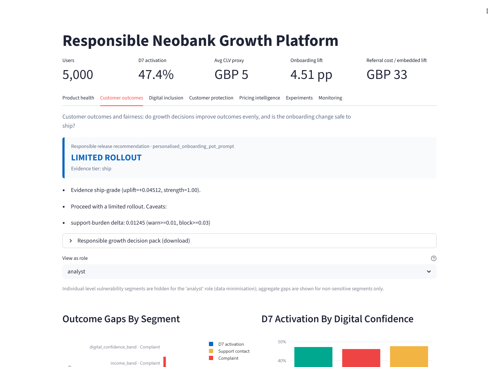
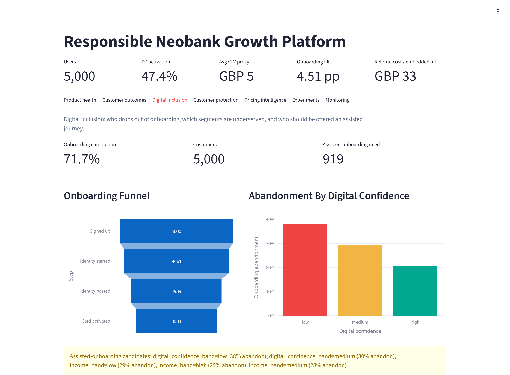

# Responsible Neobank Growth Platform

[](https://github.com/rosscyking1115/responsible-neobank-growth/actions/workflows/ci.yml)
[](https://github.com/rosscyking1115/responsible-neobank-growth/actions/workflows/monitoring-snapshot.yml)
[](pyproject.toml)
[](LICENSE)

[Live Streamlit Dashboard](https://neobank-appuct-analytics.streamlit.app/)


A synthetic fintech **decision-support platform** that combines product analytics,
experimentation, model decisioning, and pricing intelligence with customer-outcome,
fairness, inclusion, and protection guardrails — so a neobank can decide whether to
**ship, iterate, or hold** a growth action while still protecting its customers.

> All data is synthetic. No real customer data, internal bank data, or proprietary
> business metrics are used. See [Safety & ethics](#safety--ethics).

---

## Why this project exists

In most analytics demos, growth is the only goal. In financial services that framing
is dangerous: a bad e-commerce discount wastes money, but a bad fintech growth
decision can push a vulnerable customer toward a worse financial outcome. This
platform asks a sharper question than "does this action move a metric?":

> Can we grow activation, retention, referrals, and pricing conversion **while still
> delivering good customer outcomes** — and is the evidence strong enough to act?

Every analysis therefore ends in a **decision with guardrails**, and one principle is
enforced throughout the code: **customer-outcome concerns dominate commercial appeal.**
A strong uplift never overrides a block-level harm signal.

## Key features

**Core analytics, experimentation & decisioning**

- **Synthetic data generation** — deterministic, seeded `polars` generators for users,
  transactions, sessions, feature adoption, support, referrals, pricing, and
  experiment assignments with embedded ground truth.
- **dbt metrics layer** — staging plus product, pricing, experiment, geo, and finance
  marts (DuckDB locally; BigQuery as an optional target).
- **Activation decisioning model** — logistic pipeline with isotonic calibration on a
  forward time window, threshold economics, a published
  [model card](docs/model_cards/MODEL_ACTIVATION_DECISIONING.md), an artifact
  registry, and batch scoring.
- **Experimentation & causal inference** — Welch difference-in-means, CUPED, SRM,
  heterogeneous effects, confidence-interval guardrails, difference-in-differences
  with clustered standard errors, parallel trends, placebo-in-space, and synthetic
  control.
- **FastAPI service** — scoring, offer-recommendation, and pricing-scenario contracts,
  each returning a decision, reason codes, and guardrail flags.

**Responsible-growth modules**

- **Financial wellbeing layer** — synthetic wellbeing/vulnerability proxies with
  *executable* permitted/prohibited-use guardrails and fairness-gap metrics
  ([docs](docs/FINANCIAL_WELLBEING_PROXIES.md)).
- **Customer Outcomes & Fairness** — segment fairness gaps plus a live release-gate
  verdict on the onboarding A/B (dashboard tab).
- **Responsible release-gate engine** — maps evidence + guardrails to
  `ship / limited_rollout / experiment_only / needs_human_review / block`
  ([docs](docs/RELEASE_DECISION_FRAMEWORK.md)).
- **Fair-value pricing governance** — scores each offer's fair value and downgrades
  commercially attractive but unfair offers ([docs](docs/FAIR_VALUE_PRICING.md)).
- **Digital inclusion & onboarding funnel** — who drops out, which segments are
  underserved, who needs an assisted journey ([docs](docs/DIGITAL_INCLUSION.md)).
- **Customer-protection / scam-intervention simulation** — risk-triggered *supportive*
  responses that never block a payment ([docs](docs/CUSTOMER_PROTECTION_SIMULATION.md)).
- **Responsible growth decision pack** — consolidates every engine's output into one
  stakeholder report with a business-impact summary, exportable from the dashboard as
  HTML or Excel ([docs](docs/RESPONSIBLE_GROWTH_REPORT.md)).
- **Public-data calibration** — anchors the synthetic wellbeing/inclusion distributions
  to verified UK public benchmarks (ONS, DWP, Lloyds) and reports the gaps
  ([docs](docs/PUBLIC_DATA_CALIBRATION.md)).
- **Real-data adapter** — runs the same fairness/outcome analysis on the real UCI Bank
  Marketing dataset, proving the pipeline works on real inputs
  ([docs](docs/REAL_DATA_ADAPTER.md)).
- **Access control & data minimisation** — a lightweight RBAC layer that restricts
  individual-level vulnerability data to governance roles, with a role selector in the
  dashboard ([docs](docs/ACCESS_CONTROL.md)).

## What decisions it supports

| Question a growth / product / governance team asks | What the platform provides |
| --- | --- |
| Should we ship this onboarding treatment? | D7 activation A/B readout (CUPED, SRM) plus a release-gate verdict. |
| Which users need onboarding **help** (not upsell)? | Calibrated activation model targeting *low-propensity* users, with a vulnerable-customer review path. |
| Are referral incentives genuinely incremental? | Geo difference-in-differences with parallel-trends, placebo, and synthetic-control checks. |
| Is this pricing offer attractive **and fair**? | Offer economics, scenario runs, and a fair-value governance verdict. |
| Are vulnerable or digitally excluded customers worse off? | Segment fairness gaps and onboarding-abandonment analysis. |
| Should this transfer trigger support? | Supportive scam-intervention simulation (education → soft friction → cooling-off → human review). |

## Dashboard views

The **Customer Outcomes** tab turns the analysis into a decision: a release-gate verdict
with its reasons, role-based access to sensitive segments (data minimisation), and
segment fairness gaps.



The **Digital Inclusion** tab shows who drops out of onboarding and which segments are
underserved — here, onboarding abandonment rises sharply for lower digital-confidence
customers.



## Technology stack

| Layer | Tools |
| --- | --- |
| Language / runtime | Python 3.12+, managed with `uv` |
| Data generation | `polars`, Faker-style synthetic events, Parquet |
| Analytics engineering | dbt, DuckDB, BigQuery |
| Experimentation | CUPED, SRM, CI-based guardrails, DiD, synthetic control (`scipy`, `statsmodels`, `linearmodels`) |
| Modelling | `scikit-learn`, isotonic calibration, model card, batch scoring |
| Application | Streamlit dashboard, FastAPI prediction service |
| Cloud | Cloud Storage, BigQuery, Cloud Run, Cloud Scheduler, Cloud Monitoring |
| Quality | `pytest`, `ruff`, GitHub Actions, monitoring snapshot workflow |

## Project architecture

```text
Synthetic event generator  (users, transactions, sessions, features, support,
        |                    referrals, pricing, wellbeing, onboarding, protection)
        v
DuckDB / Parquet  ──►  dbt metrics layer  ──►  Streamlit dashboard
        |                                        (7 decision tabs)
        ├──►  modelling + experiments  ──►  model card, memos, monitoring
        ├──►  responsible-growth engines (release gates, fair value, inclusion,
        |                                  protection) ──►  decisions with guardrails
        └──►  FastAPI service  ──►  scoring, offer, and pricing contracts

Optional GCP path:
   Cloud Storage ─► BigQuery (raw + marts) ─► Cloud Run jobs + private API
                                              ─► Cloud Scheduler + Monitoring
```

See [docs/ARCHITECTURE.md](docs/ARCHITECTURE.md) for the full local and cloud
architecture.

## Getting started

**Prerequisites:** Python 3.12+ and [`uv`](https://docs.astral.sh/uv/). No cloud
account is required — the entire platform runs locally.

```powershell
uv sync --group dev
uv run python -m data_generator.generate --users 5000 --months 6 --output-dir raw/ci
uv run dbt build --project-dir dbt_neobank --profiles-dir dbt_neobank
uv run pytest
uv run streamlit run app/streamlit_app.py
```

Run the API locally:

```powershell
uv run uvicorn api.main:app --reload   # then open http://127.0.0.1:8000/docs
```

For a portfolio-size dataset, generate with `--users 50000 --months 12` and pass
`--vars "{raw_path: raw/portfolio_full}"` to `dbt build`.

## Project structure

```text
api/                    FastAPI prediction & pricing service
app/                    Streamlit dashboard (7 decision tabs)
data_generator/         Seeded synthetic event & proxy generators
dbt_neobank/            dbt metrics layer (staging + marts)
src/
  experiments/          CUPED, SRM, DiD, synthetic control, guardrails
  modelling/            Activation model: train, calibrate, score, explain
  monitoring/           Monitoring snapshot, model & calibration reports
  pricing/              Pricing scenario runs
  pricing_governance/   Fair-value scoring & governance
  wellbeing/            Wellbeing proxy guardrails & fairness metrics
  inclusion/            Onboarding funnel & digital-exclusion analysis
  release_decisions/    Responsible release-gate engine
  protection/           Scam-intervention simulation
  cloud/                GCP load / verify / deploy plan generators + jobs
docs/                   Architecture, case study, module docs, model card
tests/                  pytest suite
```

## Development workflow

- Work happens on feature branches (`feat/...`, `chore/...`) and merges to `main` via
  pull request; the responsible-growth modules were delivered as a stacked PR chain.
- Every PR runs the CI pipeline below; `main` is the protected default branch.
- Synthetic data, DuckDB files, dbt `target/`, and `artifacts/` are git-ignored — only
  source is tracked, so the repo stays reproducible from the generators.

## Coding standards

- `ruff` (line length 100; `E`, `F`, `I`, `UP`, `B`, `SIM` rule sets) — `uv run ruff check .`
- Type hints throughout; typed Pydantic contracts at the API boundary and frozen
  dataclasses for engine inputs/outputs.
- Guardrail boundaries are executable, not doc-only: prohibited uses of wellbeing
  proxies and non-supportive protection actions raise/are rejected in code.

## Testing

```powershell
uv run pytest            # full suite
uv run ruff check .      # lint
uv run dbt build --project-dir dbt_neobank --profiles-dir dbt_neobank   # marts + dbt tests
```

The suite covers the data generators, statistical methods, the decision engines, the
dbt-backed dashboard helpers, and the cloud plan generators. The GitHub Actions CI
pipeline runs lint → notebook check → tests → synthetic data → `dbt build` → API
container build → authenticated `/health` smoke test.

## Documentation

| Document | Purpose |
| --- | --- |
| [docs/CASE_STUDY.md](docs/CASE_STUDY.md) | Business-facing case study, decisions, evidence, limitations. |
| [docs/ARCHITECTURE.md](docs/ARCHITECTURE.md) | Local and cloud architecture. |
| [docs/API.md](docs/API.md) | Prediction and pricing-scenario API contract. |
| [docs/RELEASE_DECISION_FRAMEWORK.md](docs/RELEASE_DECISION_FRAMEWORK.md) | Release-gate decisions and resolution order. |
| [docs/FINANCIAL_WELLBEING_PROXIES.md](docs/FINANCIAL_WELLBEING_PROXIES.md) | Wellbeing data dictionary and use boundaries. |
| [docs/FAIR_VALUE_PRICING.md](docs/FAIR_VALUE_PRICING.md) | Fair-value scoring and pricing governance. |
| [docs/DIGITAL_INCLUSION.md](docs/DIGITAL_INCLUSION.md) | Onboarding funnel and digital-exclusion analysis. |
| [docs/CUSTOMER_PROTECTION_SIMULATION.md](docs/CUSTOMER_PROTECTION_SIMULATION.md) | Scam-intervention simulation. |
| [docs/RESPONSIBLE_GROWTH_REPORT.md](docs/RESPONSIBLE_GROWTH_REPORT.md) | Consolidated stakeholder decision pack (HTML / Excel). |
| [docs/PUBLIC_DATA_CALIBRATION.md](docs/PUBLIC_DATA_CALIBRATION.md) | Calibrating synthetic distributions to public benchmarks. |
| [docs/REAL_DATA_PROVENANCE.md](docs/REAL_DATA_PROVENANCE.md) | Verified public sources behind the calibration anchors + real-dataset options. |
| [docs/REAL_DATA_ADAPTER.md](docs/REAL_DATA_ADAPTER.md) | Running the fairness analysis on the real UCI Bank Marketing dataset. |
| [docs/ACCESS_CONTROL.md](docs/ACCESS_CONTROL.md) | RBAC / data-minimisation over sensitive wellbeing fields. |
| [docs/MONITORING.md](docs/MONITORING.md) | Data, model, score, and GCP monitoring checks. |
| [docs/OPERATIONS_RUNBOOK.md](docs/OPERATIONS_RUNBOOK.md) | Rollback triggers, triage, and GCP operations. |

## Cloud path

The GCP path has been exercised beyond local development: a Cloud Storage landing
zone loaded into BigQuery, a dbt graph run against BigQuery, an activation score
extract and monitoring result written to BigQuery, a private Cloud Run API and Cloud
Run scoring/monitoring jobs, Cloud Scheduler runs, and Cloud Monitoring alert policies
plus a budget and storage-lifecycle policy for cost control. See
[docs/CLOUD_RUN_DEPLOYMENT.md](docs/CLOUD_RUN_DEPLOYMENT.md) and
[docs/GCP_WAREHOUSE.md](docs/GCP_WAREHOUSE.md).

> The recorded BigQuery figures (13 raw tables, 107 dbt checks) reflect the cloud run
> *before* the responsible-growth pivot. The load manifest now covers all 16 raw
> tables; the new wellbeing, inclusion, and protection tables and marts are exercised
> locally and would be reloaded on the next GCP run.

## Safety & ethics

This project uses **synthetic data** and is **not** a production banking, fraud,
credit, eligibility, or financial-advice system. Vulnerability, wellbeing, and
inclusion fields are synthetic proxies for evaluating product decisions and must not
be used to deny services, set prices unfairly, determine creditworthiness, or make
punitive decisions. The customer-protection module is a supportive-intervention
simulation, not a fraud engine. It does not represent any real financial institution.

## What would be hardened for production

A regulated deployment would add stronger API protection (API Gateway / IAP / JWT,
rate limits, structured logging); formal data governance (row/column controls,
retention, lineage, cost controls); keyless OIDC CI/CD with image scanning, SBOMs, and
IaC; a model registry / feature store with shadow deployments and online/offline
parity; and formal privacy, Consumer Duty, model-risk, and approval controls before any
live customer decisioning. (A lightweight access-control / data-minimisation layer over
sensitive wellbeing data is already demonstrated — see
[docs/ACCESS_CONTROL.md](docs/ACCESS_CONTROL.md); production would enforce it with real
identity, row/column-level security, and audit logging.)

## Contributing

This is a synthetic portfolio project. Issues and suggestions are welcome — please run
`uv run ruff check .` and `uv run pytest` before opening a pull request.

## License

Released under the [MIT License](LICENSE).
