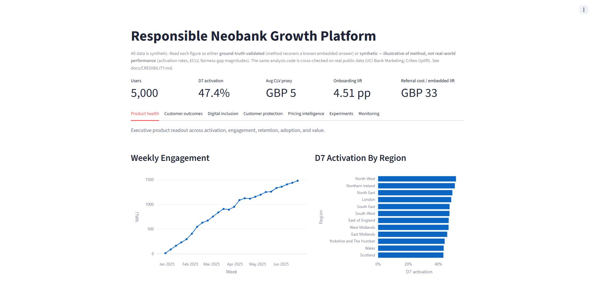

# Responsible Neobank Growth — Analytics Engineering Platform

[](https://github.com/rosscyking1115/responsible-neobank-growth/actions/workflows/ci.yml)
[](https://github.com/rosscyking1115/responsible-neobank-growth/actions/workflows/monitoring-snapshot.yml)
[](pyproject.toml)
[](LICENSE)
[](https://responsible-neobank-growth.streamlit.app/)
[](https://huggingface.co/datasets/rosscyking/responsible-neobank-growth-events)

I built a synthetic neobank whose backend events misbehave on purpose — late,
duplicated, reversed, schema-evolving — and a governed dbt warehouse that turns
them into trusted Growth and referral-reward interfaces. The events are
generated against a known-truth manifest, so the warehouse's correctness can be
checked rather than asserted. On top of that, I ran an honest cost benchmark:
does an incremental warehouse produce the same answer as a full rebuild, and
what does each actually cost?

> Everything here is synthetic. No affiliation with Monzo or any bank; no real
> customer, internal, or proprietary data. Monzo's public engineering writing
> shaped which problems I chose, not how any of it is built. See
> [Safety & ethics](#safety--ethics).

**What ran:**

- the four-layer warehouse runs locally on DuckDB and executed on BigQuery under
  a small, capped budget — one dated benchmark run, not a live service;
- full-refresh and incremental builds matched exactly at every governed
  interface, across all three phases;
- the cost result is measured and mixed, and I report it that way (below).

## Why known truth

Most analytics demos start from clean data and treat growth as the only goal.
A real neobank has neither luxury: events arrive late, duplicated, corrected and
reversed, schemas change under you, and a bad growth decision can leave a
vulnerable customer worse off. So the source here is built with the answer known
in advance. Every duplicate, late arrival, reversal, malformed payload and
missing posting is injected against a manifest. That is what makes the
incremental-versus-full comparison and the reward reconciliation mean anything —
there is a fixed truth to check against, not a plausible-looking output to
trust.

## Every check here is tested for detection

The property this project is actually built around, stated plainly:

> **Attestation is not enforcement.** A log, an assertion or a green test is not
> a guarantee. A check is only real if something fails when you take it away.

So every detector in this repository is itself tested against deliberate negative
controls — inputs constructed to be wrong, which the detector must catch. Three
worked examples, each reproducible:

**The standards checker is tested for precision, not just detection.**
[`tests/standards/`](tests/standards/) holds five deliberately-invalid manifest
fixtures, one per rule — missing owner, missing unique key, missing freshness
SLO, missing partition policy, and non-incremental materialisation without a
documented exemption. Each must produce **exactly one** violation, and it must be
the *expected* one, so a rule that fired on everything would fail the suite just
as surely as one that fired on nothing. A sixth, valid fixture must produce none,
which pins the false-positive side. The CLI's exit codes are checked in both
directions. Separately,
[`tests/standards/test_real_manifest.py`](tests/standards/test_real_manifest.py)
runs the same rules against the real `dbt_neobank/target/manifest.json`, so the
rules are proven to fire on fixtures *and* proven to hold on the actual build.

**The causal estimators are tested for immunity to their own answer key.**
The generator embeds the truth it is asking the analysis to recover, which is
exactly the setup where a project can fool itself.
[`tests/test_no_circularity.py`](tests/test_no_circularity.py) poisons the input:
it injects `true_d7_lift_pp = 99.0` into frames whose observed gap is about
+6pp, and asserts the estimate is **byte-identical** to the unpoisoned run — not
merely close. It repeats this for CUPED and for the fairness `outcome_gap`, and
adds a structural check that the release engine's input dataclass cannot carry a
generator-only field at all. An estimator that peeked would move; these cannot.

**Corruption is applied after valid generation, so truth stays separable.**
The pipeline is `apply_faults(generate_valid_events(config), config)` — faults
are a transformation over already-valid output, not something woven through
generation. The ordering is guaranteed by composition rather than by convention,
and the clean layer is exercised on its own in
[`tests/event_simulator/test_lifecycles.py`](tests/event_simulator/test_lifecycles.py).
That is what makes "the correct answer is known in advance" survive contact with
duplicates, late arrivals, reversals and schema drift.

None of this is specific to fintech. It is a way of building checks that holds
wherever a check is supposed to mean something.

## Architecture

```text
Synthetic service events        (campaign, application/KYC, activation/funding,
  (versioned envelope)           referral/reward, experiment, customer-outcome)
        |
        v
Immutable delivery batches + quarantine     (append-only; bad payloads kept as evidence)
        |
        v
Landing (lnd_*)  ->  Normalised (nrm_*)  ->  Logical / governed interfaces (lgl_*)
        |                 |                          |
        |            SCD2 / current state           v
        |                                    Presentation (prs_*)
        |                                          |
        |                          +---------------+----------------+
        |                          v                                v
        |                     Streamlit /                      ML features /
        |                     decision app                     scoring
        v
Truth manifest  ->  correctness + reward-reconciliation oracle
BigQuery job metadata  ->  warehouse-health interface
```

Only normalised and logical models are governed interfaces; presentation models
are replaceable. The existing analytics reach the interfaces through
compatibility views, so nothing that already worked was thrown away. The full
local and cloud picture is in [docs/ARCHITECTURE.md](docs/ARCHITECTURE.md).

## What holds up

Each result is checked by a test or a command in this repository — run
`uv run python -m tools.ci.verify_pipeline` to reproduce the local proof end to
end.

| Result | How it's checked |
|---|---|
| Standard profile: 568,789 deliveries in 356 batches, identical logical checksum across two runs | `cli generate` ×2 + `cli compare` (`tests/event_simulator/test_reproducibility.py`) |
| dbt build: 68 models, 217 data tests, 4 unit tests green | `uv run dbt build --project-dir dbt_neobank --profiles-dir dbt_neobank --target dev` (`PASS=289`, plus 4 exposures as NO-OP); also executed on BigQuery |
| Full versus incremental: exact match at all six governed interfaces (base/delta/repair) | blue/green harness `tools/reconcile/compare_interfaces.py` (`tests/oracles/test_incremental_execution.py`) |
| Cost, measured and mixed: incremental billed +1.95% bytes but used −62.7% compute; partitioning cut one query's scan 523.9× | BigQuery benchmark (below) |
| Late-event recovery: a held-back day missed by the 3-day lookback, recovered by a bounded backfill | `tools/reconcile/backfill.py` (`tests/oracles/test_incremental_execution.py`) |
| Reward reconciliation: debits equal credits, opening plus movements equals closing, every injected exception caught | `tests/oracles/test_reward_reconciliation_execution.py` + `dbt_neobank/tests/logical/` |
| Full local suite: 400 pytest tests and 289 dbt-build results pass with no cloud account | `uv run pytest` · `uv run dbt build --project-dir dbt_neobank --profiles-dir dbt_neobank --target dev` |

## Quick start (local, no cloud account)

Python 3.12+ and [`uv`](https://docs.astral.sh/uv/). The whole local platform
runs on DuckDB.

Generate the tiny profile twice and check it reproduces:

```powershell
uv sync --group dev
uv run python -m src.event_simulator.cli generate --profile tiny --output data/generated/tiny-a
uv run python -m src.event_simulator.cli generate --profile tiny --output data/generated/tiny-b
uv run python -m src.event_simulator.cli compare --left data/generated/tiny-a --right data/generated/tiny-b
```

Run the whole local proof — generation, ingestion, dbt build, standards,
full-versus-incremental parity, tests:

```powershell
uv run python -m tools.ci.verify_pipeline
```

### What CI runs on every push

[`.github/workflows/ci.yml`](.github/workflows/ci.yml) does the same proof, plus
two things worth calling out:

- **Determinism is proven, not asserted** — CI generates the tiny profile twice
  into separate directories and fails unless `cli compare` finds the checksums
  identical. A generator that quietly drifted would break the build.
- **Both containers are built** — the FastAPI image (`Dockerfile.api`) and the
  Cloud Run jobs image (`Dockerfile.jobs`). The API image is additionally started
  and polled on `/health` until it answers, so the build proves the service comes
  up, not just that it compiles. The jobs image is build-only.

## Governed interfaces

Each interface answers one question and has one owner and one authoritative
grain ([`docs/metrics/metric-ownership.yml`](docs/metrics/metric-ownership.yml)).

| Interface | Question | Owner |
|---|---|---|
| `growth_acquisition` | Where do applicants move or drop between application, approval and funded activation? | Growth |
| `referral_economics` | Do referrals bring in incremental activated customers at a reward cost worth paying? | Growth / Finance |
| `reward_reconciliation` | Which expected rewards are missing, duplicated, mismatched, stale or wrongly reversed? | Finance |
| `warehouse_health` | Which interfaces are stale, failing, expensive or slower than their baseline? | Platform |

Contracts live in [`contracts/interfaces/`](contracts/interfaces/). To be exact
about what "contract" means here, because dbt uses the word for something
narrower: **no model sets dbt's own `contract: enforced: true`.** The contracts
in this project are YAML interface contracts and JSON-Schema event contracts,
and they are enforced by a checker rather than by dbt.

### How the interfaces are actually governed

- **Standards-as-code.** [`tools/standards/check_dbt_interfaces.py`](tools/standards/check_dbt_interfaces.py)
  reads [`rules.yml`](tools/standards/rules.yml) and fails CI when a governed
  `nrm_`/`lgl_` model omits an owner, purpose, grain, unique key, freshness SLO,
  classification, version, compatibility policy or declared exposures. It runs
  against the **real** `dbt_neobank/target/manifest.json`, not a copy
  (`tests/standards/test_real_manifest.py`). Five deliberately-invalid fixture
  manifests in [`tests/standards/fixtures/`](tests/standards/fixtures/) prove
  each rule actually fails when violated, alongside a valid one that must pass —
  so the checker is tested for detection, not just for running clean.
- **Blue/green reconciliation.** [`tools/reconcile/compare_interfaces.py`](tools/reconcile/compare_interfaces.py)
  asserts full-refresh and incremental builds produce identical output at all six
  governed interfaces, across every scenario, with no tolerance on keys or
  integer financial values.
- **History from occurrence time, never ingestion time.** The SCD2-style models
  [`nrm_account_history.sql`](dbt_neobank/models/normalised/nrm_account_history.sql)
  and [`nrm_referral_history.sql`](dbt_neobank/models/normalised/nrm_referral_history.sql)
  rebuild state intervals from the event log ordered by business occurrence time
  with deterministic tie-breakers, so a late or replayed delivery cannot rewrite
  when something happened.
- **Declared consumers.** Four dbt exposures (one typed `ml`) tie the presentation
  layer to the things that read it, so breaking a consumer is visible in lineage.
- **Bounded BI re-derivation.** [`docs/metrics/metric-ownership.yml`](docs/metrics/metric-ownership.yml)
  gives every metric one authoritative owner and a `bi_may` clause saying what BI
  is permitted to re-derive (for example: aggregate, but do not reimplement
  qualification eligibility). Two metrics claiming the same name fail a test
  (`tests/contracts/test_interface_contracts.py`).

## The BigQuery benchmark

The comparison is set up to be hard to game. On an identical final event state,
it pits rebuilding all history after a new-event batch against processing that
batch plus the frozen lookback. The Base, Delta and Repair phases (90/9/1 by
ingestion) were fixed before any output was looked at.

The result is mixed, and I report it as measured. On 569k deliveries,
incremental billed 1.95% more bytes than a full rebuild while using 62.7% less
compute. The byte figure is not a surprise once you see why: the raw event store
is unpartitioned, so every strategy scans the whole landing view. The ablation
shows where byte savings actually come from — the same seven-day reconciliation
query scanned 523.9× fewer bytes on partitioned storage. Full refresh stays the
simpler choice for the raw-scan parts; incremental's win here is compute, and
partitioning is what buys bytes. None of it is extrapolated to production or
Monzo scale.

## Downstream consumers (the responsible-growth work)

The data-science methodology from earlier in the project's life is kept as a set
of consumers of the governed interfaces, reached through compatibility views
rather than rewritten:

- **Experimentation** — CUPED, SRM, heterogeneous effects, difference-in-
  differences with clustered standard errors, parallel-trends, placebo-in-space
  and synthetic control; the Welch/CUPED/SRM estimators run unchanged on the
  governed `growth_acquisition` data
  ([a worked decision](docs/WORKED_DECISION_ONBOARDING_AB.md)).
- **Responsible release-gate engine** — evidence and customer-outcome guardrails
  resolve to `ship / limited_rollout / experiment_only / needs_human_review /
  block`, and a harm signal beats commercial uplift
  ([framework](docs/RELEASE_DECISION_FRAMEWORK.md)).
- **Fairness, wellbeing, inclusion, protection** modules and a fair-value pricing
  check, over synthetic proxies with executable use boundaries and RBAC
  ([access control](docs/ACCESS_CONTROL.md)).
- **Activation model + FastAPI service** — calibrated scoring from the governed
  feature interface.
- **Real-data cross-checks** — the same estimators re-run on real public data,
  UCI Bank Marketing and Criteo Uplift, as method validation
  ([UCI](docs/REAL_DATA_ADAPTER.md) · [Criteo](docs/REAL_DATA_CRITEO.md)).
- **Marketing measurement** — this project absorbed my separate
  marketing-effectiveness lab: the MMM-versus-experiment reconciliation and its
  parameter-recovery checks now live here
  ([reconciliation](docs/case-studies/mmm-experiment-reconciliation.md) ·
  [parameter recovery](docs/methodology/parameter-recovery-validation.md) ·
  [benchmark note](docs/methodology/mmm-benchmark-note.md)).

These surface in the Streamlit decision app.



## Synthetic data — what the numbers are, and aren't

**If you read one supporting document, read
[docs/CREDIBILITY.md](docs/CREDIBILITY.md).** It is where the project states
which of its numbers can be trusted and on what grounds, and it is the honest
answer to the fair question a reviewer should ask of any synthetic project:
*is this real signal, or a generator the author tuned?*

Results split three ways, kept apart there:

- **engineering truth** — exact outcomes from the generator's manifest (event,
  duplicate, quarantine, ledger and exception counts);
- **method validation** — causal and statistical recovery against seeded truth
  and the two real-data adapters;
- **illustrative magnitude** — activation rates, £CLV and fairness-gap sizes are
  not evidence about real customers.

The data is engineered for coverage, not calibrated to any bank, and generation
and analysis are kept separate so the recovery is not circular (tested in
`tests/test_no_circularity.py`).

## Technology

| Layer | Tools |
|---|---|
| Language / runtime | Python 3.12+, `uv` |
| Event simulator | seeded generators, virtual clock, JSON Schema contracts |
| Ingestion | append-only Parquet, checksum-gated batch registry, quarantine |
| Analytics engineering | dbt (four layers, incremental, unit tests) with YAML interface contracts checked against the built manifest, DuckDB local / BigQuery |
| Application | Streamlit decision app, FastAPI service |
| Experimentation | CUPED, SRM, DiD, synthetic control (`scipy`, `statsmodels`, `linearmodels`) |
| Modelling | `scikit-learn`, isotonic calibration, model card, batch scoring |
| Quality | `pytest`, `ruff`, GitHub Actions, standards-as-code |

## Repository map

```text
contracts/        event/interface/scenario JSON-Schema + YAML contracts
src/
  event_simulator/  deterministic generator (domains, scenarios, writers)
  ingestion/        append-only loader + quarantine
  experiments/ modelling/ wellbeing/ inclusion/ release_decisions/ protection/  downstream consumers
  adapters/         real-data method-validation adapters
dbt_neobank/      four-layer warehouse (landing/normalised/logical/presentation/compatibility)
dataset/          synthetic event benchmark (tiny committed; standard built on demand)
tools/            standards checker, reconciliation harness, dataset builder, local verify runner
docs/             architecture, contracts, metrics, module docs
tests/            pytest suite
```

> **A note on the name.** The published repository, the live dashboard and every
> link above use **`responsible-neobank-growth`**. Some local checkouts and older
> internal references use the earlier directory name `neobank-product-analytics`.
> Same project; the published name is the current one.

More: [docs/ARCHITECTURE.md](docs/ARCHITECTURE.md) ·
[docs/CREDIBILITY.md](docs/CREDIBILITY.md) ·
[docs/GCP_WAREHOUSE.md](docs/GCP_WAREHOUSE.md) ·
[docs/CLOUD_RUN_DEPLOYMENT.md](docs/CLOUD_RUN_DEPLOYMENT.md).

This project is **complete and frozen** as of 2026-07-27. Four candidate next
directions were assessed and declined on evidence; the reasoning is recorded in
[docs/FUTURES_DECLINED.md](docs/FUTURES_DECLINED.md) so it does not get
re-litigated.

## Safety & ethics

Synthetic data, and not a production banking, fraud, credit, eligibility or
financial-advice system — and not affiliated with Monzo or any bank. The
vulnerability, wellbeing and inclusion fields are synthetic proxies for testing
product decisions; they must not be used to deny services, set prices unfairly,
judge creditworthiness, or make punitive decisions. The customer-protection
module is a supportive-intervention simulation, not a fraud engine.

## Licence and citation

[MIT](LICENSE) © 2026 Cheng-Yuan King. Independent synthetic reference project;
if you cite it, cite the repository and commit. No affiliation with Monzo Bank
Ltd is claimed or implied.
