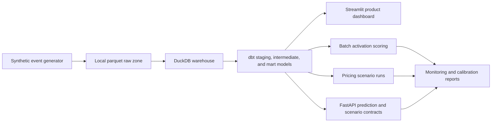
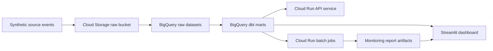

# Architecture

This project is a synthetic customer growth and pricing intelligence platform.
It keeps the local path fully reproducible while documenting the cloud path a
fintech team would use for a production version.

## Local Product Architecture

## Cloud-Ready Target

## Product Surfaces

- Streamlit dashboard: product health, pricing intelligence, experiments, and
  monitoring status.
- FastAPI service: activation, churn, upsell, offer recommendation, and pricing
  scenario contracts.
- Batch artifacts: activation score extracts, model monitoring reports, pricing
  scenario runs, and sensitivity CSVs.
- dbt warehouse: trusted marts for activation, retention, engagement, pricing,
  experiments, finance, and geo incrementality.

## Governance Boundaries

- All data is synthetic.
- The activation model is used for helpful onboarding prioritisation, not credit,
  eligibility, account limits, or punitive customer treatment.
- Pricing outputs are synthetic offer and incentive scenarios, not regulated
  credit pricing or real personalised pricing.
- Vulnerable-customer flags, complaint rates, support load, calibration, and
  drift are treated as release gates.
