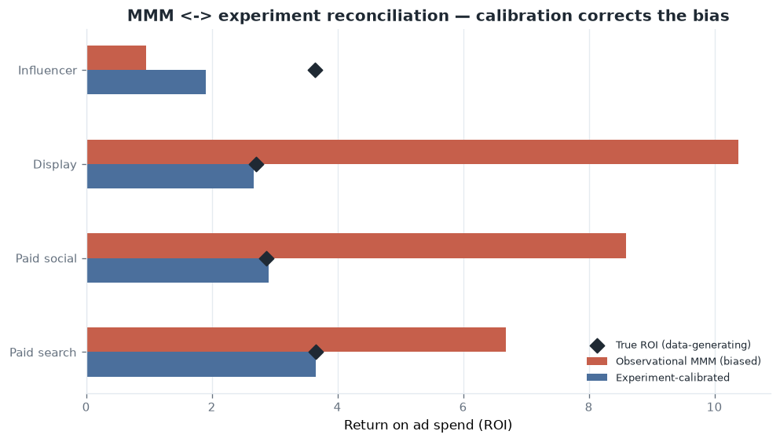

# Case study: closing the causal loop (MMM ↔ experiment reconciliation)

> **Absorbed from [marketing-effectiveness-lab](https://github.com/rosscyking1115/marketing-effectiveness-lab)**
> (now archived). The methodology is ported here because it is the same principle this
> platform is built on — *observational estimates are biased; experiments provide the
> unconfounded anchor that corrects them.* Original engine code was not ported. Live
> dashboard (kept warm from this repo): <https://marketing-effectiveness-lab.streamlit.app/>.
>
> 🟢 *This is a ground-truth-validated result* — the demo data is generated from known
> parameters, so the size of the bias and the correction are **measured against the truth**,
> not asserted. Same philosophy as this repo's [CREDIBILITY.md](../CREDIBILITY.md).

## The problem

A marketing-mix model (MMM) is observational: media spend is correlated with the seasonal
demand that also drives baseline revenue, so the model's media coefficients soak up demand
that seasonality actually caused. The result is **inflated channel ROI** — and no amount of
MMM tuning fixes it, because it is an *identification* problem, not a fitting problem.

What fixes it is an **incrementality experiment** (a geo holdout or conversion-lift test):
an unconfounded causal contrast that measures a channel's *true* lift. A calibration layer
then reconciles the biased MMM toward that evidence.

## The demonstration

Because the demo data is generated from known parameters, an *honest* geo-lift can be
simulated: each experiment recovers the true incremental revenue over an 8-week window (plus
realistic ±5% measurement error). Three quantities are then compared per channel — the
**true** ROI, the **observational MMM** ROI, and the **experiment-calibrated** ROI.

| Channel | True ROI | Observational MMM | Experiment-calibrated |
| --- | --- | --- | --- |
| Paid search | 3.66× | 6.68× | **3.66×** |
| Paid social | 2.86× | 8.59× | **2.90×** |
| Display | 2.70× | 10.37× | **2.67×** |
| Influencer | 3.64× | 0.95× | **1.91×** (clipped) |

Across the experiment-covered channels, the **mean absolute ROI error falls from 4.78× to
0.45× — a ~91% reduction** (`reconciliation_summary.json`: 90.5% bias reduction). The raw
observational estimate would have driven large over-investment in display and paid social.

## Honest nuances (ported as-is)

- **Influencer only partly corrects.** The MMM badly *under*-attributed it (0.95× vs a true
  3.64×), and the calibration factor is deliberately clipped to `[0.25, 2.0]` so one noisy
  test cannot swing an estimate arbitrarily far — a guardrail that costs full correction of a
  severely mis-estimated channel, stated rather than hidden.
- **Uncovered channels stay put.** Channels with no experiment retain their MMM estimate; you
  only get causal correction where you actually ran a test.
- **Evidence is governed.** Only approved, quality-scored tests (on duration, precision,
  metadata) feed calibration.

## Why it sits in this repo

This platform makes the same move in the fintech-growth domain: it never trusts an
observational metric on its own, embeds a **known ground truth** to validate the estimator
against, and lets **experimental / causal evidence** drive the decision (see
[CREDIBILITY.md](../CREDIBILITY.md) and the geo-lift synthetic-control work). Reconciling MMM
against experiments is the marketing-measurement instance of the same discipline.
