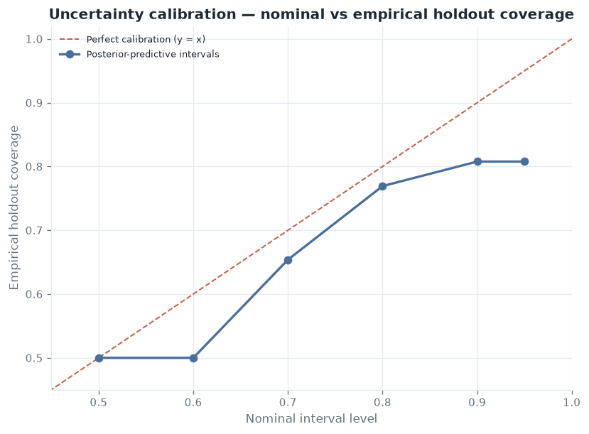
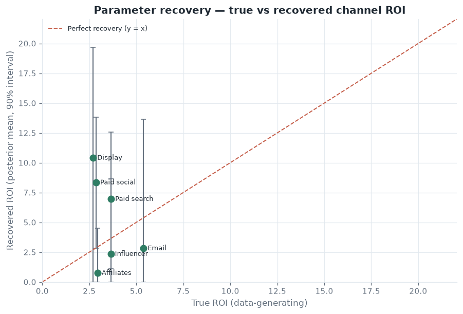

# Parameter recovery & uncertainty calibration

> **Absorbed from [marketing-effectiveness-lab](https://github.com/rosscyking1115/marketing-effectiveness-lab)**
> (now archived); docs only, no engine code. Live dashboard (kept warm from this repo):
> <https://marketing-effectiveness-lab.streamlit.app/>.
>
> This is the marketing-measurement sibling of this repo's own ground-truth discipline —
> see [CREDIBILITY.md](../CREDIBILITY.md), which makes the identical argument: a synthetic
> generator with a *known* answer is the strongest possible test of an estimator, because you
> can check whether it recovers the truth (something real data can never let you do).

Most portfolio MMM projects show a point estimate and stop. Because the demo dataset is
**generated from known** adstock, saturation, and effect parameters, it can answer the two
questions a data-science reviewer actually asks:

1. **Does the estimator recover the truth?** (parameter recovery)
2. **Is the uncertainty honest?** (interval calibration)

## A bug the recovery harness caught (the point of building one)

Building the calibration check immediately exposed a real defect in the Bayesian layer —
worth recording, because *finding it is exactly what a recovery harness is for.*

- **Symptom.** The design matrix mixes columns on wildly different scales — saturated media
  features live in `[0, 1)` while `trend_squared` reaches tens of thousands. Forming the
  Normal–Inverse-Gamma posterior on that raw matrix meant inverting a near-singular `X'X`
  (**condition number ≈ 5×10¹²**). The large-scale `trend_squared` coefficient drifted
  **~100× off** its OLS value (2558 vs 26), holdout predictions came out an order of magnitude
  too high, and **interval coverage collapsed to 0%**.
- **Fix.** Whiten each column by its L2 norm, solve the posterior in the well-conditioned
  basis (**cond ≈ 2×10²**), and map the draws back — an exact reparameterization that leaves
  the prior semantics unchanged. Afterwards the posterior tracks OLS in the well-identified
  directions (`trend_squared` → 25.9 vs 26.2) and holdout MAPE drops from **~1200% to ~5%**.
- **Guard.** A regression test (`test_bayesian_posterior_is_well_conditioned`) pins it.

This is the same failure-mode discipline this repo applies to circularity: a bug was found,
fixed, and then *locked down with a test* so it cannot silently return
([tests/test_no_circularity.py](../../tests/test_no_circularity.py) is this repo's analogue).

## 1. Uncertainty calibration

For each nominal level, measure the fraction of held-out weeks that fall inside the
posterior-predictive interval. Perfect calibration sits on the diagonal.

| Nominal | 50% | 60% | 70% | 80% | 90% | 95% |
| --- | --- | --- | --- | --- | --- | --- |
| Empirical holdout coverage | 50% | 50% | 65% | 77% | **81%** | 81% |

The intervals are **close to, and slightly narrower than, nominal** — the 90% band covers
~81% of the 26 held-out weeks. An honest result: roughly-right uncertainty with mild
over-confidence at the tails (expected for a conjugate posterior over a *fixed*
adstock/saturation design). Reported as-is, not tuned to land on 90%.

## 2. Parameter recovery

Each channel's **true** ROI (from the generating process) versus the **recovered** posterior
mean, with 90% credible intervals. Perfect recovery sits on the diagonal.

**Headline finding — calibrated, but biased.** All **6/6** true channel ROIs fall inside
their 90% credible intervals (the model *knows what it doesn't know*), but the point
estimates are inflated **~2–3×** (paid search 7.0× vs a true 3.7×; display 10.4× vs 2.7×),
and collinear channels are crushed toward zero. This is not a coding error — it is the
**identification problem** of observational MMM: controls cannot fully absorb continuous
seasonality, so media coefficients soak up demand seasonality caused.

That is precisely why the engine has an incrementality-calibration layer, and why the
[reconciliation case study](../case-studies/mmm-experiment-reconciliation.md) closes the loop
— calibration cuts the ROI bias measured here by ~91%. Recovery *quantifies the size of the
bias the experiments are there to remove.*

## Honest limitations (ported)

- Single dataset / single seed; rolling-origin cross-validation is the natural next step.
- The Bayesian layer is a posterior over the *fixed* transformed design; it does not sample
  the adstock/saturation parameters, so it understates transform uncertainty — visible as the
  mild tail under-coverage above.
